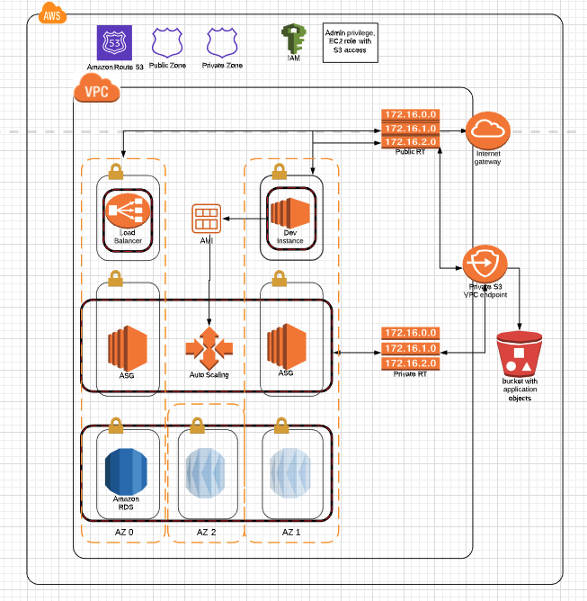

### Deploy web application using Terraform and Ansible. Use Route53 to create hosted zones and route traffic to desired domains



## Overview
Application has 3 tier Architechture
1. Development Server  - Used to build the application. It is deployed in a public subnet.
2. Application Tier - AutoScaling group instances that host the application. Autoscaling group instances are deployed in multi AZ 2 private subnets
3. Database Tier - MySQL database with multi AZ deployment in private 3 subnets
A load balancer is used to make application hosted by autoscaling group available to public users.

Route53
Has two hosted zones, public and private with same domain name
Public Hosted Zone
-Has records for Development instance and the Load Balancer
Private Hosted Zone
-Has record for MYSQL RDS instances

S3 Bucket
Bucket is used to host the application code. After any application code changes are made on the Dev instance, they are pushed to S3 bucket. A cron job automatically pulls code from the S3 bucket using a VPC endpoint every 5 mins. The latest pulled code used to update the autoscaling group Launch configuration

## &emsp; &emsp; &emsp; &emsp; &emsp; &emsp; &emsp; &emsp; &emsp; &emsp;Project Setup

## 1. Create Infrastructure
To deploy the infrastructure use terraform apply command on the main.tf file &nbsp;
```terraform apply ```

## 2. Navigate to dev instance dev.cloudcumulonimbus.com. Update wordpress site URL to www.cloudcumulonimbus.com

## 3. Open www.cloudcumulonimbus.com and website should be up and running
