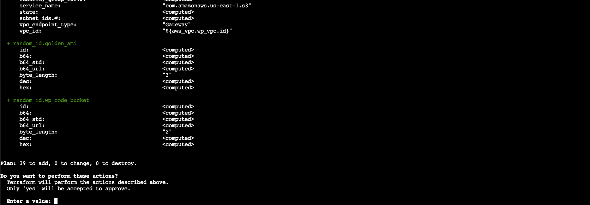
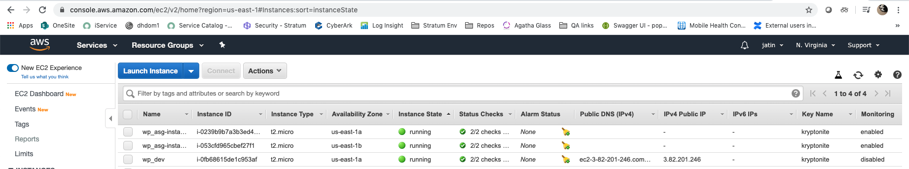
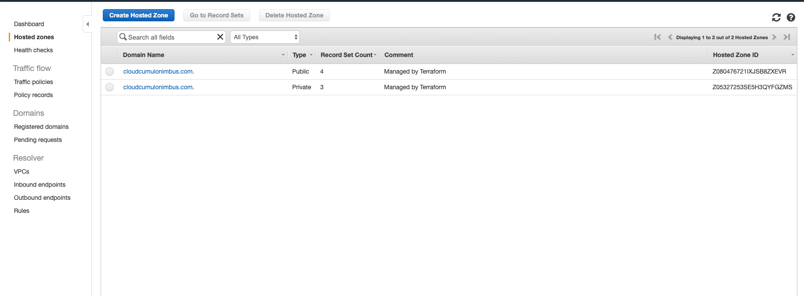
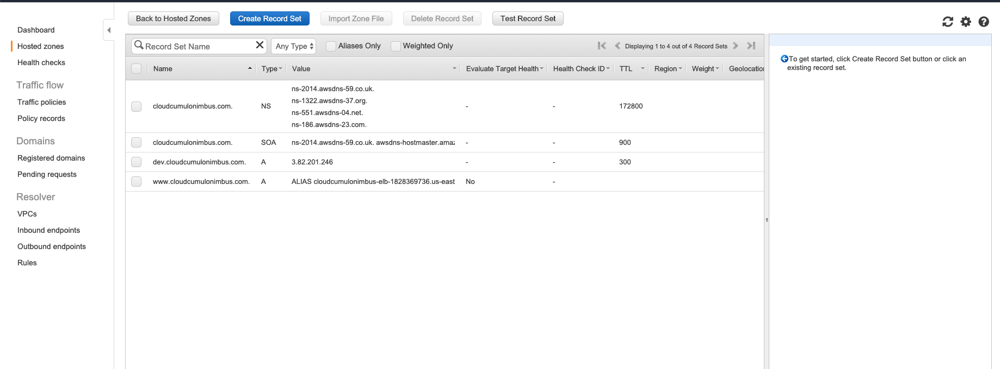
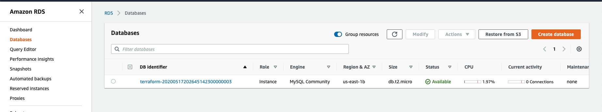
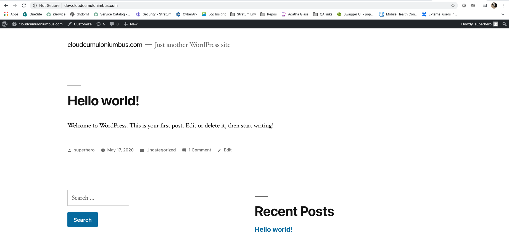
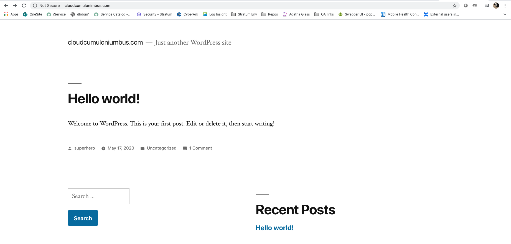

# Images of successful deployment completion

#### Terraform resources are created

####  EC2 - Dev instance and autoscaling group are running

#### Route53 Hosted Zones

#### Public Zone Records

#### S3 Bucket with code created

#### Wordpress up and running on Development Instance. Route53 is routing traffic as expected

#### Wordpress up and running on Application Instances. Route53 is routing traffic to public domain

